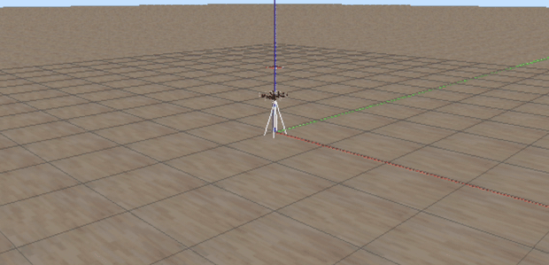
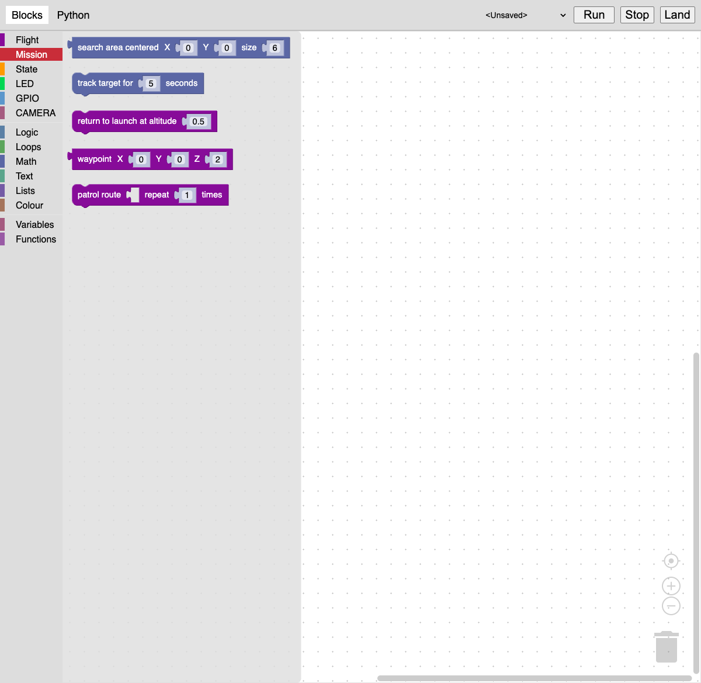

# Autonomous Search-and-Rescue Drone — a visual DSL for mission planning

A fork of the [Clover](https://github.com/CopterExpress/clover) drone framework, extended with a **Google Blockly visual programming language for autonomous search-and-rescue missions**. Blocks compile to executable Python that flies a PX4 drone in Gazebo SITL, running an OpenCV vision pipeline that searches a survey area, detects a target, and tracks it in world coordinates.

Built as a capstone research project in programming-language design at Chapman University: the question was whether a domain-specific visual language could make autonomous UAV mission planning accessible to non-programmers without hiding the real flight stack underneath.

**Stack:** ROS Noetic · PX4 SITL · Gazebo 11 · OpenCV · tf2 · Python · C++ · JavaScript / Google Blockly

---

## Demo



The drone arms, takes off, flies a serpentine survey pattern, detects the red target, tracks it while it moves, then returns to its launch point and lands. Console output on the right shows the navigation state transitions in real time.

*Full-resolution version: [`media/drone_demo.mp4`](media/drone_demo.mp4)*

---

## What this fork adds

| Area | Contribution |
|---|---|
| **Visual DSL** | New `find_target` block encapsulating an entire search-and-detect mission; extended block library and Python code generator (`blocks.js` +516 lines, `python.js` +396 lines) |
| **Computer vision** | HSV target detection with dual-range red masking, moments-based centroiding, and pinhole back-projection from image coordinates to 3D world points |
| **Flight logic** | Serpentine (boustrophedon) area search, tf2-based target localization in the `map` frame, position-hold tracking, and return-to-launch |
| **Simulation** | Custom Gazebo world with a **moving** target — the detection problem is tracking, not a static lookup |
| **Composable mission blocks** | `search_area`, `track_target`, `return_to_launch`, `waypoint`, `patrol_route` — primitives that snap together, so a mission is written with ordinary `if`/`else` rather than one monolithic block |
| **Test harness** | Headless golden-file tests for the code generator (`tests/`) — runs the real generators in Node with no browser, ROS or drone |

---

## Architecture

```
Blockly workspace  ──▶  python.js generator  ──▶  mission.py
   (browser UI)          (code generation)         (ROS node)
                                                       │
                              ┌────────────────────────┴────────────────────────┐
                              ▼                                                 ▼
                    OpenCV vision pipeline                          Clover simple_offboard
                 camera_info → undistort →                       navigate / set_position /
                 HSV mask → centroid →                              land / release
                 back-project → tf2 → map frame                            │
                                                                           ▼
                                                                    PX4 SITL ──▶ Gazebo
```

The web UI talks to ROS over `rosbridge_websocket` (port 9090). Generated Python runs as an ordinary ROS node, so anything the DSL produces can be read, edited, and run by hand — the abstraction is transparent rather than sealed.

### The `find_target` block

One block on the canvas — *Find Target · Search Area Center (X, Y) · Grid Size* — generates the complete mission:

```python
# search grid: serpentine sweep, 0.33 m lateral spacing, 1 m row spacing
x_range = np.round(np.linspace(x - size/2, x + size/2, int(size/.33) + 1), 2)
y_range = np.round(np.linspace(y - size/2, y + size/2, int(size/1) + 1), 2)
search_pattern = ((x, y) for i, y in enumerate(y_range)
    for x in (x_range if i % 2 == 0 else reversed(x_range)))
```

plus `move_to_next_search_point()` with `StopIteration` handling for the not-found case (return to launch and land), the image callback, and the subscriber wiring. The generator also injects the imports, service proxies, and camera-model setup the mission needs, tracked as generator dependencies so they emit exactly once.

### Vision pipeline

Red wraps the hue circle, so detection uses two ranges unioned together:

```python
mask1 = cv2.inRange(img_hsv, (0, 150, 150),   (15, 255, 255))
mask2 = cv2.inRange(img_hsv, (160, 150, 150), (180, 255, 255))
mask  = cv2.bitwise_or(mask1, mask2)
```

The centroid comes from image moments. Converting it to a world position uses the camera intrinsics from `camera_info`, `cv2.undistortPoints` to remove lens distortion, and a pinhole projection scaled by the rangefinder's terrain altitude — then `tf2` transforms that point from the camera frame into `map`, where it becomes a position setpoint. Decoupling detection from control this way means the drone commands a *world* position rather than chasing pixels.

---

### Composable mission blocks

`find_target` packs an entire mission into one block. That makes for a compact
demo but a poor language: because the generated code ends in `rospy.spin()`,
nothing can follow it, and two missions can never be combined.

The composable blocks express the same capability as pieces that snap together.



`search_area` is a **value** block returning a boolean, so it works with the
standard `if`/`else` block rather than needing bespoke control flow:

```python
# generated from: take off -> if search area (0, 0, 6) -> track / else return
navigate_wait(z=2, frame_id='body', auto_arm=True)
if search_area(0, 0, 6):
    track_target(5)
    land_wait()
else:
    return_to_launch(0.5)
    land_wait()
```

| Block | Kind | Emits |
|---|---|---|
| `search area centered X Y size S` | value (Boolean) | serpentine sweep; `True` on first detection, `False` if the grid is exhausted |
| `track target for N seconds` | statement | holds position over the target using tf2 back-projection |
| `return to launch at altitude Z` | statement | flies back to the position recorded at program start |
| `waypoint X Y Z` | value (Array) | a single map-frame point |
| `patrol route [...] repeat N times` | statement | flies a waypoint list, repeated |

The trade-off is deliberate: these drive the perception helpers synchronously
with `wait_for_message` instead of subscribing, which is exactly what removes
the need for `spin()` and makes them composable.

---

## The flight scripts

Three versions in [`clover/examples/`](clover/examples/), kept deliberately to show how the mission logic developed:

| File | Behavior |
|---|---|
| `red_circle_og.py` | Manual baseline — detect and follow, triggered by keypress. No autonomy. |
| `red_circle_v2.py` | Generated by the Blockly toolchain. Autonomous takeoff, area search, detection, 10 s of tracking, then land on target. Split-callback design: the vision callback publishes to `~red_circle`, a target callback transforms and commands. |
| `red_circle_v3.py` | Hand-extended from generated output. Tracks for 20 s, releases the offboard setpoint stream, returns to the launch position, and lands there. |

The v2 → v3 step is the interesting one: the generated code is the starting point, not the ceiling. Generated structure (search grid, waypoint iterator, not-found handling) survives verbatim into v3 while the mission-completion behavior is rewritten by hand.

---

## Simulation environment

`clover_simulation/models/red_circle/red_circle.sdf` converts the stock static marker into a Gazebo `<actor>` with a looping 35-second trajectory — it holds position for 5 s, translates 10 m over 15 s, and returns. This is what makes the demo a tracking problem: by the time the drone has localized the target, the target has moved.

`clover_red_circle.world` hosts it with grid and origin visuals disabled for a clean camera view, and `simulator.launch` loads that world instead of the stock ArUco scene.

---

## Running it

Requires a working Clover/ROS Noetic environment with PX4 SITL built ([upstream setup guide](https://clover.coex.tech/en/simulation_native.html)).

```bash
# 1. simulation + Blockly UI (this fork enables the blocks node by default)
./tools/run_sim.sh          # wrapper - see the two gotchas below
#   or, if your environment already handles them:
roslaunch clover_simulation simulator.launch

# 2. fly a mission
rosrun clover red_circle_v3.py
```

**Two gotchas when running headless or over SSH**, both of which produce
misleading symptoms. `tools/run_sim.sh` handles them:

- **PX4 SITL needs an open stdin.** It runs an interactive shell (`pxh>`), so
  under `nohup`, `setsid` or `< /dev/null` it gets EOF, prints `Exiting NOW.`
  and quits. roslaunch then reports a *segfault* in `sitl_0` — that segfault is
  teardown wreckage, not the cause. Fix: `sleep infinity | roslaunch ...`.
- **Gazebo needs an X display even with `gui:=false`**, to create a GL context
  for camera sensors. Without one you get
  `Unable to create CameraSensor. Rendering is disabled` — and because the
  camera feeds optical flow, the EKF never gets a stable position estimate, so
  **the drone arms but will not climb** and the mode drops from `OFFBOARD` to
  `ALTCTL`. A flight-control symptom with a rendering cause. Fix: export
  `DISPLAY` and `XAUTHORITY`.

The Blockly page is served from `clover_blocks/www/` — on a stock desktop install it needs the static web root generated (`rosrun roswww_static update`) and a web server pointed at `~/.ros/www`; the official Clover Raspberry Pi image does both already.

### Tests

The Python code generator is tested headlessly — no browser, ROS or drone
required, because the generators are pure functions from a block to a string:

```bash
cd tests && npm install && npm test
```

Each test renders a mission (`tests/missions/*.xml`) through the real
`generateCode()` entry point and diffs the result against a checked-in golden
file. `npm run test:update` rewrites the goldens, so any change to a generator
shows up as a reviewable diff in the next commit.

---

## Status and known limitations

- `find_target` is retained for compatibility but is effectively a whole program: it ends in `rospy.spin()`, so no block can follow it. New missions should use the composable blocks instead.
- The two paths now **share their perception code** (`RED_HSV_LOW`/`HIGH`, `redMaskLines`, `searchGridLines`), so the detector is tuned in one place. They still emit *different programs* though: `find_target` emits callbacks plus `spin()`, the composable blocks emit a linear script. Making `find_target` literally call `search_area` would change its runtime model from callback-driven to polling — a behaviour change, not a refactor, so it is deliberately not done. The golden test enforces that `find_target`'s output stays byte-for-byte fixed.
- `search_area` and `track_target` poll frames with `wait_for_message` rather than subscribing, which is what makes them composable. Detection rate is therefore bounded by the round trip, and is lower than the callback-driven path.
- Search-grid parameters are tuned for the demo scene; coverage guarantees scale with camera FOV and altitude and have not been formally verified.
- The tests cover **code generation**, not flight behaviour — they prove the generator emits what it should, not that the drone flies correctly.
- Four upstream scaffolding blocks (`key_pressed`, `on_armed`, `on_take_off`, `on_landing`) have definitions but no generators. They are dead in upstream too and are not reachable from the toolbox.
- Tested in Gazebo SITL only (verified running on an ARM64 Ubuntu 20.04 VM: camera at ~20 Hz, takeoff to 2 m holding `OFFBOARD`). No hardware flights yet — porting to a physical Clover airframe is the intended next step.

---

## Credits

Upstream [Clover](https://github.com/CopterExpress/clover) is developed by [COEX](https://coex.tech) and licensed under the MIT License. The original upstream README is preserved at [`README.upstream.md`](README.upstream.md). Everything described above is my own work on top of that framework.
